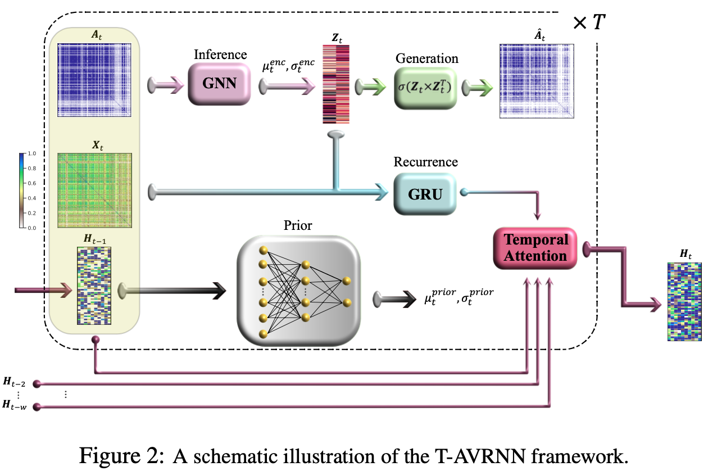

# Temporal Attention-enhanced Variational Graph Recurrent Neural Network

This repository contains the code associated with the paper:

**"T-AVRNN: Attention-enhanced Variational Graph Recurrent Neural Network Captures Neural Dynamics and Behavior"**.

## Abstract

We present **T-AVRNN** (Temporal Attention-enhanced Variational Graph Recurrent Neural Network), a novel framework designed to analyze the dynamic evolution of neuronal connectivity networks in response to external stimuli and behavioral feedback. T-AVRNN models sequential snapshots of neuronal activity, revealing critical connectivity patterns over time. By incorporating temporal attention mechanisms and variational graph methods, the framework identifies how shifts in connectivity align with behavior. We validate T-AVRNN using two datasets: in vivo calcium imaging data from freely behaving rats and novel in vitro electrophysiological data from the DishBrain system, where biological neurons control a simulated Pong game. T-AVRNN surpasses previous models in classification, clustering, and computational efficiency while accurately linking connectivity changes to performance variations. Notably, it reveals a correlation between high game performance and the alignment of sensory and motor subregion channels, a relationship not detected by earlier models. This work marks the first dynamic graph representation of electrophysiological data from the DishBrain system, offering key insights into the reorganization of neuronal networks during learning. T-AVRNN’s ability to differentiate between neuronal states associated with successful and unsuccessful learning outcomes highlights its potential for real-time monitoring and manipulation of biological neuronal systems.

<div style="text-align: center;">
    
</div>

<div style="text-align: center;">
    
</div>

## Data Description

The dataset includes neuronal data from 24 different cultures integrated on HD-MEAs during 437 experimental sessions (262 ‘Gameplay’; 175 ‘Rest’). The data was recorded at 20 kHz sampling frequency, with spiking events from sensory and motor channels extracted for analysis. Each session contains 20 minutes of gameplay or 10 minutes of rest.

## Key Features

- **Temporal Attention Mechanism**: Enhances the model's sensitivity to changes over time by evaluating the similarity of the network’s structure across different time steps.
- **Variational Graph Recurrent Neural Network (VGRNN)**: Captures the complex interplay between network topology and node attributes.
- **Dynamic Graph Representation**: Utilizes zero-lag Pearson correlations to construct network adjacency matrices, representing functional connectivity between neuronal channels.

## Repository Structure

- `T-AVRNN_DishBrain.ipynb`: Jupyter notebook containing the implementation of the T-AVRNN model and analysis.

## Requirements

To run the code in this repository, you will need the following packages:


```bash
- python 3.x
- scikit-learn
- scipy
- NumPy
- Pytorch
pip install torch-scatter
pip install torch-sparse
pip install torch-cluster
pip install torch-spline-conv
pip install torch-geometric==1.0.2
pip install torchvision


