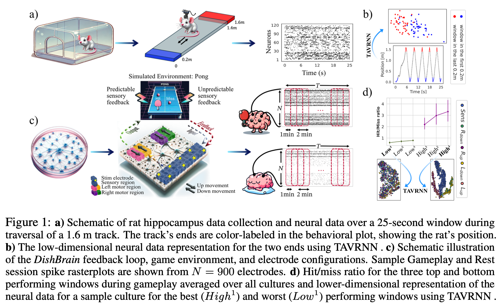

# Temporal Attention-enhanced Variational Graph Recurrent Neural Network

This repository contains the code associated with the paper:

**"TAVRNN: Temporal Attention-enhanced Variational Graph RNN Captures Neural Dynamics and Behavior"**.

## Abstract

We present **TAVRNN** (Temporal Attention-enhanced Variational Graph Recurrent Neural Network), a novel framework designed to analyze the dynamic evolution of neuronal connectivity networks in response to external stimuli and behavioral feedback. TAVRNN models sequential snapshots of neuronal activity, revealing critical connectivity patterns over time. By incorporating temporal attention mechanisms and variational graph methods, the framework identifies how shifts in connectivity align with behavior. We validate TAVRNN using two datasets: in vivo calcium imaging data from freely behaving rats and novel in vitro electrophysiological data from the DishBrain system, where biological neurons control a simulated Pong game. TAVRNN surpasses previous models in classification, clustering, and computational efficiency while accurately linking connectivity changes to performance variations. Notably, it reveals a correlation between high game performance and the alignment of sensory and motor subregion channels, a relationship not detected by earlier models. This work marks the first dynamic graph representation of electrophysiological data from the DishBrain system, offering key insights into the reorganization of neuronal networks during learning. TAVRNN’s ability to differentiate between neuronal states associated with successful and unsuccessful learning outcomes highlights its potential for real-time monitoring and manipulation of biological neuronal systems.

<div style="text-align: center;">
    
</div>

<div style="text-align: center;">
    
</div>


## Key Features

- **Temporal Attention Mechanism**: Enhances the model's sensitivity to changes over time by evaluating the similarity of the network’s structure across different time steps.
- **Variational Graph Recurrent Neural Network (VGRNN)**: Captures the complex interplay between network topology and node attributes.
- **Dynamic Graph Representation**: Utilizes zero-lag Pearson correlations to construct network adjacency matrices, representing functional connectivity between neuronal channels.

## Repository Structure

- `TAVRNN.ipynb`: Jupyter notebook containing the implementation of the proposed TAVRNN model and analysis.
- `Baselines/DynamicGEM-AE-RNN-AERNN/Baselines Dyn.ipynb`: Jupyter notebook containing the implementation of the baseline methods introduced in Goyal et al. 2018 and Goyal et al. 2020.
- `Baselines/GraphERT/Baseline GraphERT.ipynb`: Jupyter notebook containing the implementation of the beasline methods introduced in Beladev et al. 2023.

## Requirements

To run the code in this repository, you will need the following packages:


```bash
cebra==0.4.0
matplotlib==3.8.0
networkx==3.1
nilearn==0.10.4
numpy==2.1.1
pandas==2.2.3
plotly==5.9.0
scikit_learn==1.2.2
scipy==1.14.1
seaborn==0.13.2
torch==2.4.1
torch_geometric==2.6.1
torch_scatter==2.1.2
torchvision==0.19.1


